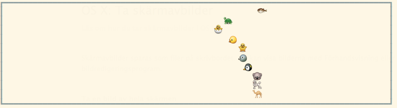
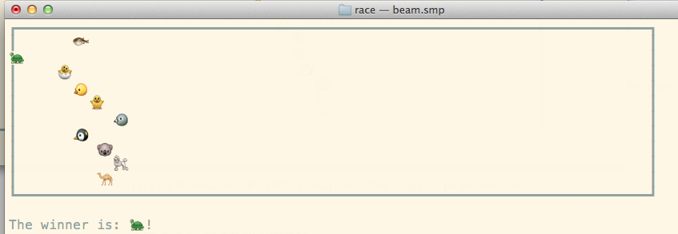

Elixir Race
===========

A very simple race simulation meant to be run in an IEx session in a console with UTF-8 support.

This is a toy project mostly for the purpose of playing around with Elixir.


## Usage

Meant to be run in an IEx session.

```
iex> Race.start_race
```

## Screenshots





## License
MIT
